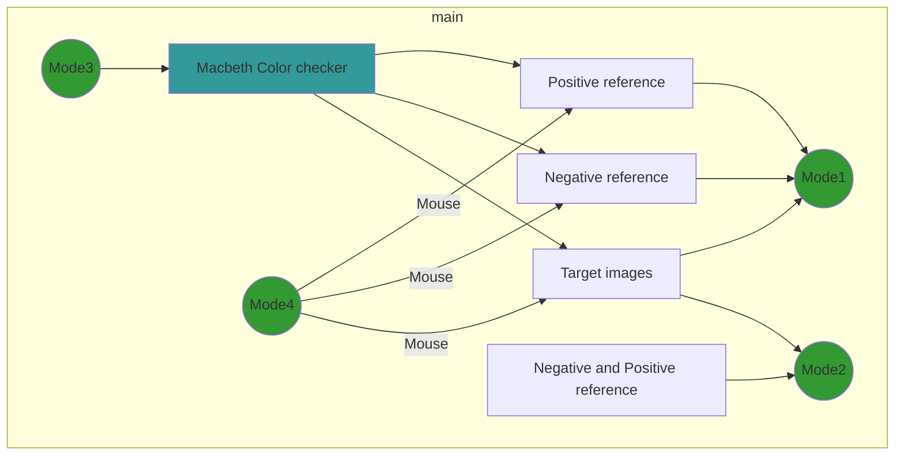
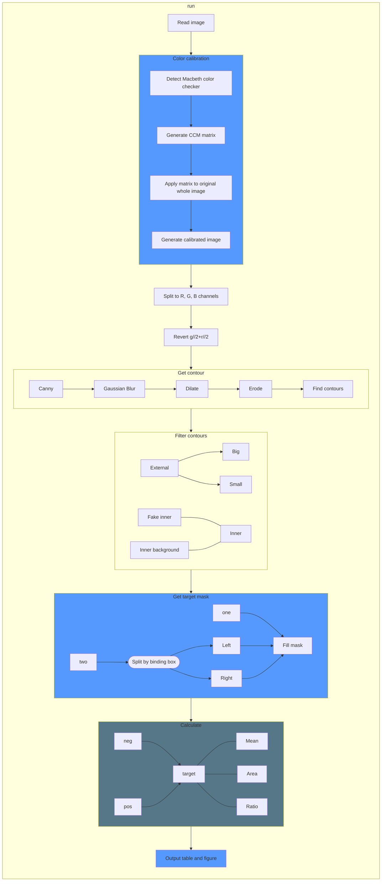

# pyGUS
quantification for GUS stain images


```mermaid
flowchart TB
    subgraph main
        m1((Mode1))
        m2((Mode2))
        m3((Mode3))
        m4((Mode4))
        targets[Target images]
        c[Macbeth Color checker]
        ref1[Positive reference]
        ref2[Negative reference]
        ref3[Negative and Positive reference]
        targets
        ref1 & ref2 & targets --> m1
        ref3 & targets --> m2
        m3 --> c --> ref1 & ref2 & targets
        m4 -- Mouse --> ref1 & ref2 & targets
        style c fill:#399
        style m1 fill:#393
        style m2 fill:#393
        style m3 fill:#393
        style m4 fill:#393
    end
    
```

```mermaid
flowchart LR
    subgraph run
        g1[Read image]
        g1.5[[Color calibration]]
        g2[Split to R, G, B channels]
        g3[Revert g//2+r//2]
        g4[Get edge]
        g5[Filter contours]
        g6[Get target mask]
        g7[Calculate]
        g8[Output table and figure]
        g1 --> g1.5 --> g2 --> g3 --> g4 --> g5 --> g6 --> g7 --> g8 
        style g1.5 fill:#59f
        style g6 fill:#59f
        style g7 fill:#557788
        style g8 fill:#59f
    end
    subgraph g1.5[Color calibration]
        direction TB
        c1[Detect Macbeth color checker]
        c2[Generate CCM matrix]
        c3[Apply matrix to original whole image]
        c4[Generate calibrated image]
        c1 --> c2 --> c3 --> c4
    end
    subgraph g4[Get contour]
        direction LR
        g41[Canny] --> g42[Gaussian Blur] --> g43[Dilate] --> g44[Erode]
        g44 --> g45[Find contours]
    end
    subgraph g5[Filter contours]
        direction LR
        g51[External] --> Big & Small 
        g52[Inner]
        g53[Fake inner]
        g54[Inner background]
        g53 & g54 --- g52
    end
    subgraph g6[Get target mask]
        direction LR
        one
        two --> s([Split by binding box]) --> Left & Right
        one & Left & Right --> f[Fill mask]
    end
    subgraph g7[Calculate]
        direction LR
        neg & pos --> target --- Mean & Area & Ratio
    end

```
## build
```
python3 -m build --wheel
```

