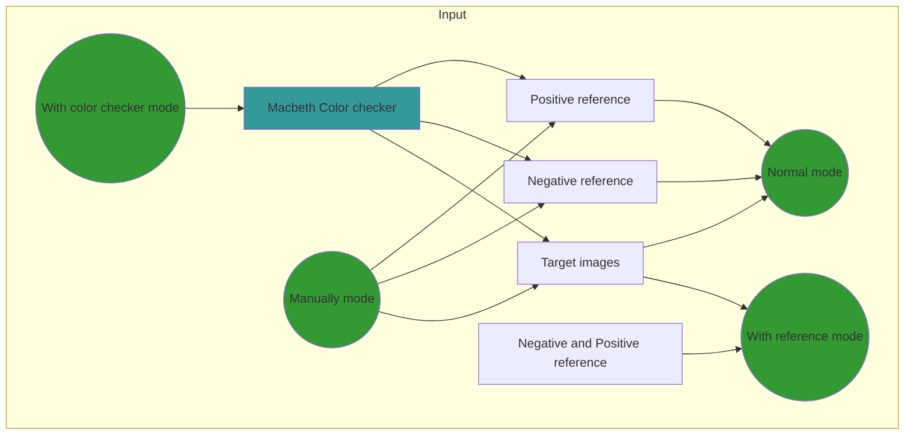
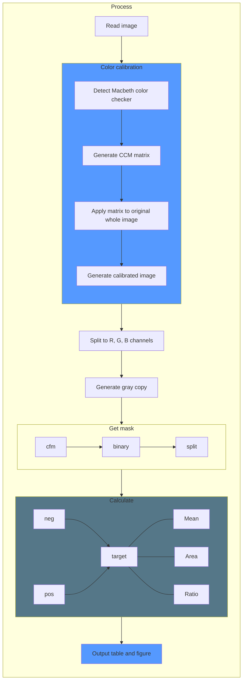

# pyGUS

[](https://badge.fury.io/py/pyGUS)

# Quick start

Download [the package](https://github.com/wpwupingwp/pyGUS/releases),
unzip, and then double-click `pyGUS.exe` or `pyGUS`.

__OR__

Make sure you have [Python](https://www.python.org/) (3.8 or higher) installed.

Open terminal, run

   ```
   # Install, using pip (recommended)
   pip install pyGUS --user
   # Or, use conda
   conda install -c wpwupingwp pyGUS
   # Run
   # Windows
   python -m pyGUS
   # Linux and MacOS
   python3 -m pyGUS
   ```

# Table of Contents

* [Quick start](#quick-start)
* [Feature](#feature)
* [Prerequisite](#prerequisite)
    * [Hardware](#hardware)
    * [Software](#software)
* [Installation](#installation)
    * [Portable](#portable)
    * [Install with pip](#Install-with-pip)
* [Usage](#usage)
    * [Desktop](#desktop)
    * [Command line](#command-line)
    * [Photo tips](#photo-tips)
    * [Input](#input)
    * [Output](#output)
* [Performance](#performance)
* [Citation](#citation)
* [Flowchart](#flowchart)

# Feature

:heavy_check_mark: Quantify GUS expression in stain images for multiple species.

:heavy_check_mark: Identify expressed regions and no expressed regions.

:heavy_check_mark: Use negative and positive references to calibrate expression 
value.

:heavy_check_mark: Support Macbeth color checker to calibrate color bias.

# Prerequisite

## Hardware

The program could run in normal computers and have no extra requirements for 
memory, CPU, et al.

Currently, macOS, Linux and Microsoft Windows systems are supported.

## Software

For the portable version, nothing needs to be installed manually.

For installing from pip, [Python](https://www.python.org/downloads/) is
required. Notice that the python version should be **3.8** or higher.

:white_check_mark: All third-party dependencies will be automatically
installed with the Internet, including `opencv-contrib-python`, `numpy`, 
`scipy`, `matplotlib`, `coloredlogs` (python packages).

# Installation

## Portable

Download from the [link](https://github.com/wpwupingwp/pyGUS/releases),
unpack and run.

## Install with pip

1. Install [Python](https://www.python.org/downloads/). *3.8 or newer* is
   required.

2. Open the command line, run

```
pip3 install pyGUS --user
```

# Usage

## Desktop

If installed with pip,

```
# Windows
python -m pyGUS
# Linux and MacOS
python3 -m pyGUS
```

If you use the portable version, double-click the `pyGUS.exe`. Then click the
button to choose which mode to run.

## Command line

:exclamation: In Linux and macOS, Python2 is `python` and Python3 is
`python3`. However, in Windows, Python3 is called `python`, too. Please
notice the difference and make sure you use `Python 3` instead of `Python 2`.

* Show help information

 ```
 # Windows
 python -m pyGUS -h 
 # Linux and MacOS
 python3 -m pyGUS -h 
 ```

* Run

 ```
 # Windows
 #   mode 1
 python -m pyGUS -mode 1 -ref1 [file1] -ref2 [file2] -images [files3] [file4] ...
 #   mode 2
 python -m pyGUS -mode 2 -ref1 [file1] -images [file2] [file3] ...
 #   mode 3
 python -m pyGUS -mode 3 -ref1 [file1] -ref2 [file2] -images [files3] [file4] ...
 #   mode 4
 python -m pyGUS -mode 4 -images [file1] [file2] ...
 # Linux and macOS
 #   mode 1
 python3 -m pyGUS -mode 1 -ref1 [file1] -ref2 [file2] -images [files3] [file4] ...
 #   mode 2
 python3 -m pyGUS -mode 2 -ref1 [file1] -images [file2] [file3] ...
 #   mode 3
 python3 -m pyGUS -mode 3 -ref1 [file1] -ref2 [file2] -images [files3] [file4] ...
 #   mode 4
 python3 -m pyGUS -mode 4 -images [file1] [file2] ...
 ```

## Input

All images should use white background.

### Negative reference

One plant (whole or partial) with low expression or no expression.

### Positive reference

One plant (whole or partial) with high expression.

### Target images

Plant images for  analysis.

### Photo tips
**These tips are for better results, not strict rules.**

#### Equipment

Cameras and stereo microscopes are recommended. Smartphones with camera
functions are not recommended, especially models with built-in color grading.
To reduce the effects of perspective distortion, lens with medium focal length
(e.g. 50 mm in full-frame) is recommended. Make sure lens and camera sensor
are free of stains.

#### Background

**White** board or **white** paper with no debris, no wrinkles, no obvious
reflection

#### Lighting

It is recommended to use the bottom lighting of the whiteboard. When
using indoor lighting, the international standard color rendering index (Ra
index) of the bulb is required to be no less than 85, and the color
temperature is between 4000 k to 7000 k; when using sunlight, avoid morning
and evening. Close overhead lighting can cause significant reflections and is
not recommended

#### Focus

The whole subject is not out of focus. Narrow down the aperture when
shooting with a camera; adjust focus and magnification when using a stereo
microscope to ensure that the edges of the subject are sharp

#### White balance

The recommended color temperature is around 6500k, with a
minimum of 4000k and a maximum of 7000k. When the color temperature cannot be
adjusted, adjust other parameters until the background is displayed in white
without obvious color cast.

#### Exposure compensation

When using camera, the exposure compensation can be set
to +1EV or +2EV to reduce the color cast of the paper. It could also reduce
the influence of the transmittance of color cards or plants

#### Layout

Based on the size of the plant, adjust the lens-to-plant distance to make the
plant cover the frame more than 50%. The main body does not cross the border,
and the distance is not less than 10% of the screen width.

When there is only a single subject, place it in the center of the frame. When
two subjects (two plants or plants with color card), place them on the left
and the right, with interval between them not less than one-third of the width
of the plant. They do not intersect, and they are not surrounded by each other
(especially one with the long roots); there is no breakage, and the leaves do
not overlap as much as possible.

#### File

No toning processing. The recommended minimum resolution is 500\*500 px. When
shooting with the camera, vignetting and distortion compensation can be turned
on, and other adjustments (including white point, black point, contrast,
brightness, style, etc.) should be turned off.

## Mode
### Normal mode

The `normal mode` requires _negative reference_ (`-ref1`),  _positive reference_
(`-ref2`) and target images (`-images`, one or more). Each image only have one 
object.

This mode requires users to add marks on the image:
1. left click mouse to add _white_ dots on the target plant
2. right click mouse to finish or press `Esc` to reset dots
3. drag to draw a box _around_ the target plant. Do not cross over the plant.
Do not draw near the border of the image, too.
4. right click mouse to finish or press `Esc` to reset the box
### With reference mode

The `with reference mode` requires one reference image (`-ref1`) with _negative 
reference on left and positive reference on right_. In each target images 
(`-images`, one or more), target plants are on left, positive references are on 
right separately.

This mode requires users to add marks on the image:
1. left click mouse to add _white_ dots on the target plant and the reference.
2. right click mouse to finish or press `Esc` to reset dots
3. drag to draw a box _around_ the target plant and the reference. Do not cross 
over the plant. Do not draw near the border of the image, too.
4. right click mouse to finish or press `Esc` to reset the box
### With color checker mode

The `with color checker mode` requires _negative reference_ (`-ref1`),  
_positive reference_ (`-ref2`) and target images (`-images`, one or more). 
In each image, the plant is on left and a Macbetch color checker is on right.

This mode requires users to add marks on the image:
1. left click mouse to add _white_ dots on the target plant and the color 
checker.
2. right click mouse to finish or press `Esc` to reset dots
3. drag to draw a box _around_ the target plant and the color checker. Do not 
cross over the plant. Do not draw near the border of the image, too.
4. right click mouse to finish or press `Esc` to reset the box
### Manually mode

The `Manually mode` requires one or more target images (`-images`). Users select
two references and target regions by mouse and press any key to continue to next
image or to start running.

## Output

`.csv` files: **csv** format table. Storage all analysis results.

`-masked.png` files: Original image with alpha channel. Background is set to
fully transparent, expressed regions are set to fully opaque.

`-select.png` files: In mode 4, the selected regions were filled with different
color. <span style="color:red">Red</span> represents negative reference, 
<span style="color:yellow">yellow</span> is for positive reference,
and <span style="color:cyan">cyan</span> is for the target region.

`-calibrate.png` files: Images calibrated with color checker.

`-fill.png` files: Images filled with different colors.
<span style="color:blue">Blue</span> means target,
<span style="color:red">red</span> means background, <span style="color:yellow">
yellow</span> means regions inner target but have different expression,
<span style="color:green">green</span> means darker regions
inner target.

# Performance

It depends on hardware and image size. Normally one image cost seconds or no 
more than one minute. The program could detect and utilize multi cores of CPU.

# Citation

Unpublished.

# License

The software itself is licensed under
[AGPL-3.0](https://github.com/wpwupingwp/pyGUS/blob/master/LICENSE)
(**not include third-party software**).

# Q&A

Please submit your questions in the
[Issue](https://github.com/wpwupingwp/pyGUS/issues) page :smiley:

* Q: I got the error message that I don't have `tkinter `module installed.

  A: If you want to run GUI on Linux or macOS, this error may happen because the
  Python you used did not include tkinter as default package (kind of weird). Run
  ```
  # Debian and Ubuntu
  sudo apt install python3-tk
  # CentOS
  sudo yum install python3-tk
  ```
  may help.

  For macOS users or linux users without root privilege, please try to install the
  newest version of Python or to use conda, see
  [conda](https://docs.conda.io/en/latest/miniconda.html)
  and [Python](https://www.python.org/download/mac/tcltk/) for details.

* Q: It says my input is invalid, but I'm sure it's OK!

  A: Please check your files' path and filename. The `space` or Chinese 
characters in the folder name or filename may cause this error.

## Flowchart



